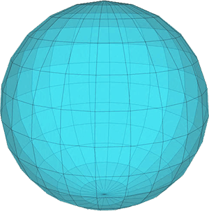

# Three.js 实现3D全景预览


## 背景

本文使用 `Three.js` `SphereGeometry` 创建 `3D` 全景图预览功能，并在全景图中添加二维 `SpriteMaterial`、`Canvas`、三维 `GLTF` 等交互点，实现具备场景切换、点击交互的侦探小游戏。


> 你是`「嘿嘿嘿侦探社」`实习侦探 `🕵️`‍，接到上级指派任务，到`「甄开心小镇」`调查市民`「甄不戳」`宝石 `💎` 失窃案，根据线人`「流浪汉老石」`提供的线索，小偷就躲在小镇，快把他找出来，帮甄不戳寻回失窃的宝石吧！

## 实现效果

左右滑动屏幕，找到 `3D` 全景场景中的 `交互点` 并点击，找出嫌疑人真正躲藏的位置。


适配移动端


> 在线预览：https://dragonir.github.io/3d-panoramic-vision/

## 代码实现

### 初始化场景

```js
// 透视摄像机
camera = new THREE.PerspectiveCamera(75, window.innerWidth / window.innerHeight, 1, 1100);
camera.target = new THREE.Vector3(0, 0, 0);
scene = new THREE.Scene();
// 添加灯光
light = new THREE.HemisphereLight(0xffffff);
light.position.set(0, 40, 0);
scene.add(light);
light = new THREE.DirectionalLight(0xffffff);
light.position.set(0, 40, -10);
scene.add(light);
// 渲染
renderer = new THREE.WebGLRenderer();
renderer.setPixelRatio(window.devicePixelRatio);
renderer.setSize(window.innerWidth, window.innerHeight);
container.appendChild(renderer.domElement);
```

### 使用球体实现全景功能

球体（SphereGeometry）



构造函数：

```js
THREE.SphereGeometry(radius, segmentsWidth, segmentsHeight, phiStart, phiLength, thetaStart, thetaLength)
```

* `radius`：半径；
* `segmentsWidth`：经度上的分段数；
* `segmentsHeight`：纬度上的分段数；
* `phiStart`：经度开始的弧度；
* `phiLength`：经度跨过的弧度；
* `thetaStart`：纬度开始的弧度；
* `thetaLength`：纬度跨过的弧度。


```js
//全景场景
geometry = new THREE.SphereGeometry(500, 60, 60);
// 按z轴翻转
geometry.scale(1, 1, -1);
// 添加贴图
outside_low = new THREE.MeshBasicMaterial({
  map: new THREE.TextureLoader().load('./assets/images/outside_low.jpg')
});
inside_low = new THREE.MeshBasicMaterial({
  map: new THREE.TextureLoader().load('./assets/images/inside_low.jpg')
});
mesh = new THREE.Mesh(geometry, outside_low);
//异步加载高清纹理图
new THREE.TextureLoader().load('./assets/images/outside.jpg', texture => {
  outside = new THREE.MeshBasicMaterial({
    map: texture
  });
  mesh.material = outside;
});
scene.add(mesh);
```

### 添加交互点

```js
var interactPoints = [
  { name: 'point_0_outside_house', scale: 2, x: 0, y: 1.5, z: 24 },
  { name: 'point_1_outside_car', scale: 3, x: 40, y: 1, z: -20 },
  { name: 'point_2_outside_people', scale: 3, x: -20, y: 1, z: -30 },
  { name: 'point_3_inside_eating_room', scale: 2, x: -30, y: 1, z: 20 },
  { name: 'point_4_inside_bed_room', scale: 3, x: 48, y: 0, z: -20 }
];
```

#### 添加二维静态图片交互点


```js
var pointTexture = new THREE.TextureLoader().load('./assets/images/point.png');
var pointMaterial = new THREE.SpriteMaterial({
  map: pointTexture
});
interactPoints.map(item => {
  let point = new THREE.Sprite(pointMaterial);
  point.name = item.name;
  point.scale.set(item.scale * 1.2, item.scale * 1.2, item.scale * 1.2);
  point.position.set(item.x, item.y, item.z);
  interactMeshes.push(point);
  scene.add(point);
});
```


```js
function loadMurderer() {
  var texture = new THREE.TextureLoader().load('./assets/models/murderer.png');
  var material = new THREE.SpriteMaterial({
    map: texture
  });
  murderer = new THREE.Sprite(material);
  murderer.name = 'murderer';
  murderer.scale.set(12, 12, 12);
  murderer.position.set(43, -3, -20);
  scene.add(murderer);
}
```

#### 添加三维动态模型锚点


```js
// 加载地标模型
var loader = new THREE.GLTFLoader();
loader.load('./assets/models/anchor.gltf', function (object) {
  object.scene.traverse(child => {
    if (child.isMesh) {
      child.castShadow = true;
      child.receiveShadow = true;
      child.material.metalness = .4;
      child.name.includes('黄') && (child.material.color = new THREE.Color(0xfffc00))
    }
  });
  object.scene.rotation.y = Math.PI / 2;
  interactPoints.map(item => {
    let anchor = object.scene.clone();
    anchor.position.set(item.x, item.y + 3, item.z);
    anchor.name = item.name;
    anchor.scale.set(item.scale * 3, item.scale * 3, item.scale * 3);
    anchorMeshes.push(anchor);
    scene.add(anchor);
  })
});
```

```js
function animate() {
  requestAnimationFrame(animate);
  anchorMeshes.map(item => {
    item.rotation.y += 0.02;
  });
}
```

#### 添加二维文字提示


```js
outsideTextTip = makeTextSprite('进入室内查找');
outsideTextTip.scale.set(2.2, 2.2, 2)
outsideTextTip.position.set(-0.35, -1, 10);
type === 'outside' && scene.add(outsideTextTip);
interactPoints = interactPoints.filter(item => item.name.includes(type));
```

```js
function makeTextSprite(message, parameters) {
  if (parameters === undefined) parameters = {};
  var fontface = parameters.hasOwnProperty("fontface") ? parameters["fontface"] : "Arial";
  var fontsize = parameters.hasOwnProperty("fontsize") ? parameters["fontsize"] : 32;
  var borderThickness = parameters.hasOwnProperty("borderThickness") ? parameters["borderThickness"] : 4;
  var borderColor = parameters.hasOwnProperty("borderColor") ? parameters["borderColor"] : { r: 0, g: 0, b: 0, a: 1.0 };
  var canvas = document.createElement('canvas');
  var context = canvas.getContext('2d');
  context.font = fontsize + "px " + fontface;
  var metrics = context.measureText(message);
  var textWidth = metrics.width;
  context.strokeStyle = "rgba(" + borderColor.r + "," + borderColor.g + "," + borderColor.b + "," + borderColor.a + ")";
  context.lineWidth = borderThickness;
  context.fillStyle = "#fffc00";
  context.fillText(message, borderThickness, fontsize + borderThickness);
  context.font = 48 + "px " + fontface;
  var texture = new THREE.Texture(canvas);
  texture.needsUpdate = true;
  var spriteMaterial = new THREE.SpriteMaterial({ map: texture });
  var sprite = new THREE.Sprite(spriteMaterial);
  return sprite;
}
```

#### 添加三维文字提示

> [使用three.js实现炫酷的酸性风格3D页面](https://juejin.cn/post/7012996721693163528)

### 鼠标捕获

```js
function onDocumentMouseDown(event) {
  raycaster.setFromCamera(mouse, camera);
  var intersects = raycaster.intersectObjects(interactMeshes);
  if (intersects.length > 0) {
    let name = intersects[0].object.name;
    if (name === 'point_0_outside_house') {
      camera_time = 1;
    } else if (name === 'point_4_inside_bed_room') {
      Toast('小偷就在这里', 2000);
      loadMurderer();
    } else {
      Toast(`小偷不在${name.includes('car') ? '车里' : name.includes('people') ? '人群' : name.includes('eating') ? '餐厅' : '这里'}`, 2000);
    }
  }
  isUserInteracting = true;
  onPointerDownPointerX = event.clientX;
  onPointerDownPointerY = event.clientY;
  onPointerDownLon = lon;
  onPointerDownLat = lat;
}
```

### 场景切换

动态修改透视相机的属性
透视相机的属性创建完成后我们也可以根据个人需求随意修改，但是注意，相机的属性修改完成后，以后要调用updateProjectionMatrix()方法来更新：

```js
//捕捉鼠标
function update() {
  lat = Math.max(-85, Math.min(85, lat));
  phi = THREE.Math.degToRad(90 - lat);
  theta = THREE.Math.degToRad(lon);
  camera.target.x = 500 * Math.sin(phi) * Math.cos(theta);
  camera.target.y = 500 * Math.cos(phi);
  camera.target.z = 500 * Math.sin(phi) * Math.sin(theta);
  camera.lookAt(camera.target);
  if (camera_time > 0 && camera_time < 50) {
    camera.target.x = 0;
    camera.target.y = 1;
    camera.target.z = 24;
    camera.lookAt(camera.target);
    camera.fov -= 1;
    camera.updateProjectionMatrix();
    camera_time++;
    outsideTextTip.visible = false;
  } else if (camera_time === 50) {
    lat = -2;
    lon = 182;
    camera_time = 0;
    camera.fov = 75;
    camera.updateProjectionMatrix();
    mesh.material = inside_low;
    new THREE.TextureLoader().load('./assets/images/inside.jpg', function (texture) {
      inside = new THREE.MeshBasicMaterial({
        map: texture
      });
      mesh.material = inside;
    });
    loadMarker('inside');
  }
  renderer.render(scene, camera);
}
```

> 完整代码：<https://github.com/dragonir/3d-panoramic-vision>

## 总结

本案例主要涉及到的知识点包括：

* 球体 SphereGeometry

## 参考资料

* [1]. [在 React 中用 Three.js 实现 Web VR 全景看房](https://juejin.cn/post/6878224140340297736)


